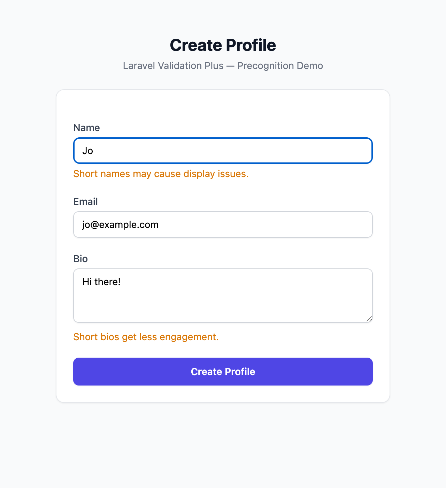
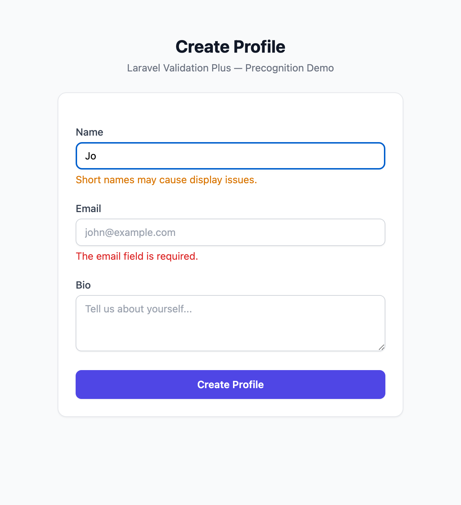

# Laravel Validation Plus

Non-blocking validation warnings for Laravel. Add advisory messages to your form requests that inform users without preventing submission.

## How It Works

Warnings are advisory messages that don't block form submission. Unlike validation errors (red, HTTP 422), warnings (amber) let the request through while informing users about potential issues.

| Warnings — form submits successfully | Errors — form is blocked |
|:---:|:---:|
|  |  |

## Installation

```bash
composer require fridzema/laravel-validation-plus
```

Optionally publish the config:

```bash
php artisan vendor:publish --tag="validation-plus-config"
```

Add the middleware to routes that need warnings:

```php
Route::middleware('warnings')->group(function () {
    // your routes
});
```

## Usage

### FormRequest

Add the `HasWarningRules` trait and define `warningRules()`:

```php
use Fridzema\ValidationPlus\Traits\HasWarningRules;
use Illuminate\Foundation\Http\FormRequest;

class StoreUserRequest extends FormRequest
{
    use HasWarningRules;

    public function rules(): array
    {
        return [
            'email' => ['required', 'email'],
            'name' => ['required', 'string'],
        ];
    }

    public function warningRules(): array
    {
        return [
            'name' => ['min:3'],
        ];
    }

    public function warningMessages(): array
    {
        return [
            'name.min' => 'Short names may cause display issues.',
        ];
    }
}
```

Warning rules are evaluated **after** standard validation passes. If validation fails, warnings are never checked.

### Manual Usage

Use `WarningValidator` directly in controllers:

```php
use Fridzema\ValidationPlus\WarningBag;
use Fridzema\ValidationPlus\WarningValidator;

$validator = app(WarningValidator::class);

$warnings = $validator->validate(
    $request->all(),
    ['name' => 'min:3'],
    ['name.min' => 'Short names may cause display issues.'],
);

// Merge into the scoped bag
app(WarningBag::class)->merge($warnings->getMessages());
```

### Blade

A `$warnings` variable (a `WarningBag` instance) is automatically shared with all views:

```blade
@if($warnings->any())
    <div class="alert alert-warning">
        <ul>
            @foreach($warnings->all() as $warning)
                <li>{{ $warning }}</li>
            @endforeach
        </ul>
    </div>
@endif
```

Or use the included component:

```blade
<x-validation-plus::warnings />
```

### API Responses

When the `ShareWarnings` middleware is active and warnings exist, API responses automatically get:

- An `X-Validation-Warnings: true` header
- Warnings merged into the JSON body under a `"warnings"` key

```json
{
    "status": "ok",
    "warnings": {
        "name": ["Short names may cause display issues."]
    }
}
```

### Precognition (Real-Time Validation)

The package integrates with [Laravel Precognition](https://laravel.com/docs/precognition) for real-time per-field warnings as users type.

| Real-time warnings | Real-time errors |
|:---:|:---:|
|  |  |

Add the `HandlePrecognitiveRequests` middleware to your route:

```php
Route::post('/profile', StoreProfileAction::class)
    ->middleware([HandlePrecognitiveRequests::class, 'warnings']);
```

Warning rules are automatically filtered by the `Precognition-Validate-Only` header, so only the field being validated is checked.

Warnings are returned in the `X-Validation-Warnings-Data` response header as JSON:

```javascript
const response = await fetch('/profile', {
    method: 'POST',
    headers: {
        'Content-Type': 'application/json',
        'Accept': 'application/json',
        'Precognition': 'true',
        'Precognition-Validate-Only': 'name',
    },
    body: JSON.stringify(form),
});

if (response.status === 204) {
    const warnings = JSON.parse(
        response.headers.get('X-Validation-Warnings-Data') || '{}'
    );
}
```

### Helper Function

```php
$bag = warnings(); // returns the scoped WarningBag
```

## Testing

Test macros are registered automatically:

```php
$response = $this->postJson('/api/users', [
    'email' => 'test@example.com',
    'name' => 'Jo',
]);

$response->assertOk();
$response->assertHasWarning('name');
$response->assertHasWarning('name', 'Short names may cause display issues.');
$response->assertHasNoWarnings('email');
$response->assertHasNoWarnings(); // no warnings at all
```

## Configuration

```php
return [
    // HTTP header added to API responses when warnings exist
    'header' => 'X-Validation-Warnings',

    // Merge warnings into JSON response body under "warnings" key
    'inject_json' => true,

    // Session key for flashing warnings on web requests
    'session_key' => 'warnings',
];
```

## Warnings vs Errors

| | Errors | Warnings |
|---|---|---|
| Block request | Yes | No |
| Cause validation failure | Yes | No |
| HTTP status | 422 | 200 (original) |
| Blade variable | `$errors` | `$warnings` |
| Session flash | Automatic | Via middleware |
| API response | Standard Laravel | Header + JSON key |

## Changelog

Please see [CHANGELOG](CHANGELOG.md) for more information on what has changed recently.

## License

The MIT License (MIT). Please see [License File](LICENSE.md) for more information.
