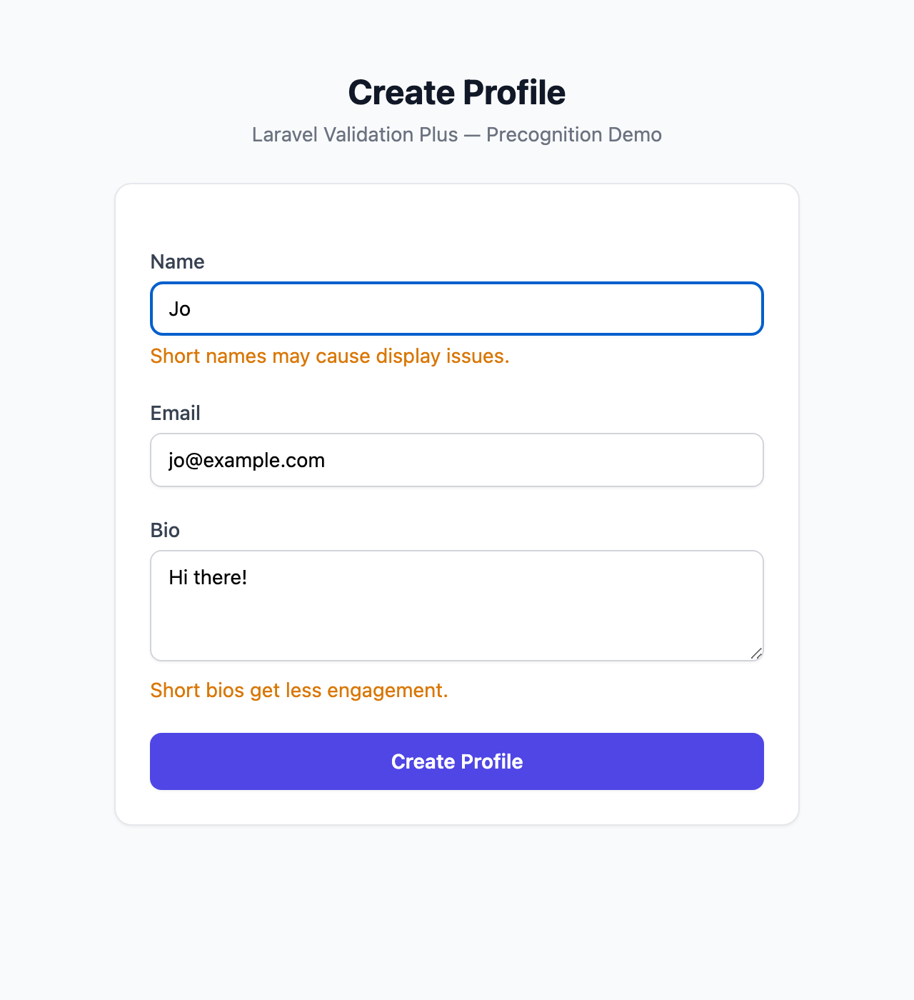
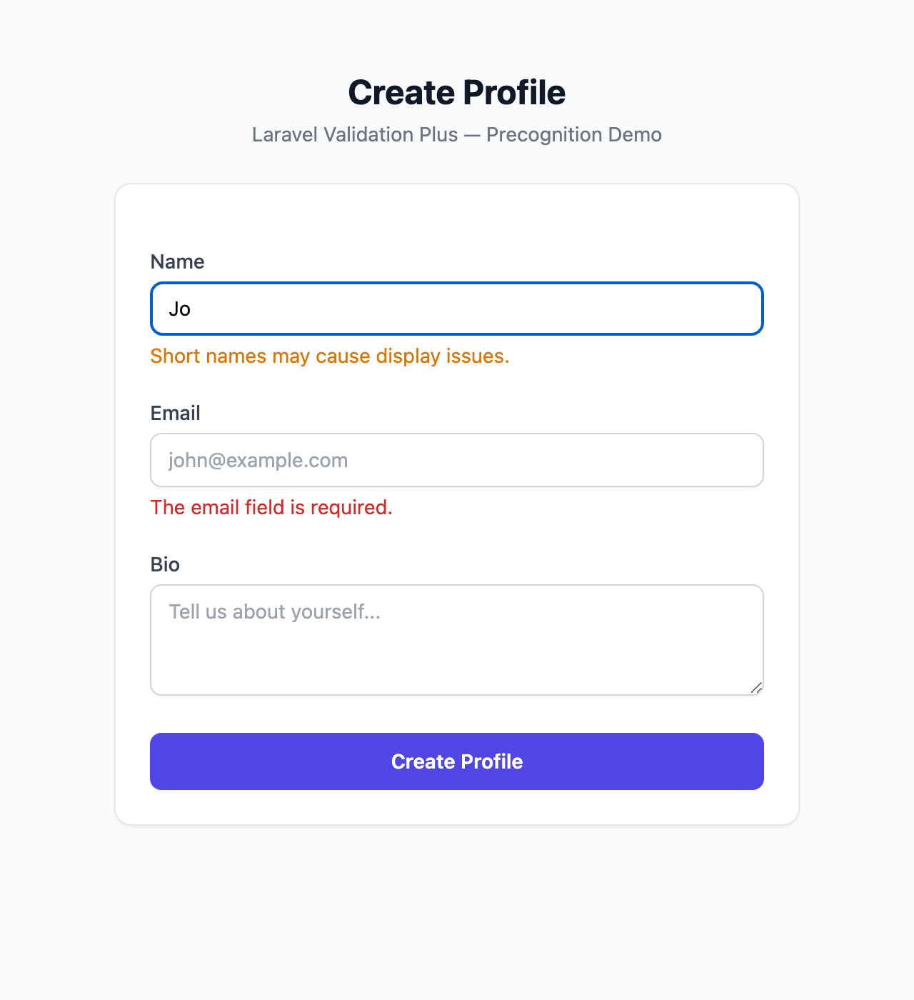

# Laravel Validation Plus

[](https://github.com/fridzema/laravel-validation-plus/actions/workflows/ci.yml)
[](https://codecov.io/gh/fridzema/laravel-validation-plus)
[](https://packagist.org/packages/fridzema/laravel-validation-plus)
[](https://packagist.org/packages/fridzema/laravel-validation-plus)
[](LICENSE.md)

Non-blocking validation warnings for Laravel. Add advisory messages to your form requests that inform users without preventing submission.

## How It Works

Warnings are advisory messages that don't block form submission. Unlike validation errors (red, HTTP 422), warnings (amber) let the request through while informing users about potential issues.

## Requirements

| Package | PHP | Laravel |
|---|---|---|
| 1.x | ^8.3 | 11.x, 12.x |

## Installation

```bash
composer require fridzema/laravel-validation-plus
```

Optionally publish the config:

```bash
php artisan vendor:publish --tag="validation-plus-config"
```

Add the middleware to routes that need warnings:

```php
Route::middleware('warnings')->group(function () {
    // your routes
});
```

## Usage

### FormRequest

Add the `HasWarningRules` trait and define `warningRules()`:

```php
use Fridzema\ValidationPlus\Traits\HasWarningRules;
use Illuminate\Foundation\Http\FormRequest;

class StoreUserRequest extends FormRequest
{
    use HasWarningRules;

    public function rules(): array
    {
        return [
            'email' => ['required', 'email'],
            'name' => ['required', 'string'],
        ];
    }

    public function warningRules(): array
    {
        return [
            'name' => ['min:3'],
        ];
    }

    public function warningMessages(): array
    {
        return [
            'name.min' => 'Short names may cause display issues.',
        ];
    }

    public function warningAttributes(): array
    {
        return [
            'name' => 'display name',
        ];
    }
}
```

Warning rules are evaluated **after** standard validation passes. If validation fails, warnings are never checked.

| Method | Purpose | Default |
|---|---|---|
| `warningRules()` | Rules that trigger warnings | `[]` |
| `warningMessages()` | Custom warning messages | `[]` |
| `warningAttributes()` | Custom field display names (`:attribute` substitution) | `[]` |

### Manual Usage

Use `WarningValidator` directly in controllers:

```php
use Fridzema\ValidationPlus\WarningBag;
use Fridzema\ValidationPlus\WarningValidator;

$validator = app(WarningValidator::class);

$warnings = $validator->validate(
    $request->all(),
    ['name' => 'min:3'],
    ['name.min' => 'Short names may cause display issues.'],
);

// Merge into the scoped bag
app(WarningBag::class)->merge($warnings->getMessages());
```

### Blade

A `$warnings` variable (a `WarningBag` instance) is automatically shared with all views:

```blade
@if($warnings->any())
    <div class="alert alert-warning">
        <ul>
            @foreach($warnings->all() as $warning)
                <li>{{ $warning }}</li>
            @endforeach
        </ul>
    </div>
@endif
```

Or use the included component:

```blade
<x-validation-plus::warnings />
```

Or use the `@warning` directive (mirrors `@error`):

```blade
@warning('name')
    <span class="text-amber-600">{{ $message }}</span>
@endwarning
```

### API Responses

When the `ShareWarnings` middleware is active and warnings exist, API responses automatically get:

- An `X-Validation-Warnings: true` header
- Warnings merged into the JSON body under a `"warnings"` key

```json
{
    "status": "ok",
    "warnings": {
        "name": ["Short names may cause display issues."]
    }
}
```

### Precognition (Real-Time Validation)

The package integrates with [Laravel Precognition](https://laravel.com/docs/precognition) for real-time per-field warnings as users type.

| Real-time warnings | Real-time errors |
|:---:|:---:|
|  |  |

Add the `HandlePrecognitiveRequests` middleware to your route:

```php
Route::post('/profile', StoreProfileAction::class)
    ->middleware([HandlePrecognitiveRequests::class, 'warnings']);
```

Warning rules are automatically filtered by the `Precognition-Validate-Only` header, so only the field being validated is checked.

Warnings are returned in the `X-Validation-Warnings-Data` response header as JSON:

```javascript
const response = await fetch('/profile', {
    method: 'POST',
    headers: {
        'Content-Type': 'application/json',
        'Accept': 'application/json',
        'Precognition': 'true',
        'Precognition-Validate-Only': 'name',
    },
    body: JSON.stringify(form),
});

if (response.status === 204) {
    const warnings = JSON.parse(
        response.headers.get('X-Validation-Warnings-Data') || '{}'
    );
}
```

### Frontend Integration

Warnings travel in two ways depending on your setup:

| Request type | Warnings location |
|---|---|
| Standard API (`Accept: application/json`) | JSON body under `warnings` key |
| Precognition (real-time, `Precognition: true`) | `X-Validation-Warnings-Data` header as JSON |

#### Axios

An interceptor that surfaces warnings on every response:

```javascript
axios.interceptors.response.use((response) => {
    const header = response.headers['x-validation-warnings-data'];
    response.warnings = header ? JSON.parse(header) : (response.data?.warnings ?? {});
    return response;
});

// Usage
const response = await axios.post('/profile', form);
if (Object.keys(response.warnings).length) {
    console.log(response.warnings); // { name: ['Short names may cause display issues.'] }
}
```

#### Vue 3

```javascript
// composables/useWarnings.js
import { ref } from 'vue';

export function useWarnings() {
    const warnings = ref({});

    function syncFromResponse(response) {
        const header = response.headers?.['x-validation-warnings-data'];
        warnings.value = header ? JSON.parse(header) : (response.data?.warnings ?? {});
    }

    const forField = (field) => warnings.value[field] ?? [];
    const hasWarning = (field) => forField(field).length > 0;
    const clear = () => { warnings.value = {}; };

    return { warnings, syncFromResponse, forField, hasWarning, clear };
}
```

```vue
<script setup>
import axios from 'axios';
import { reactive } from 'vue';
import { useWarnings } from '@/composables/useWarnings';

const form = reactive({ name: '' });
const { warnings, syncFromResponse, forField } = useWarnings();

async function submit() {
    const response = await axios.post('/profile', form);
    syncFromResponse(response);
}
</script>

<template>
    <form @submit.prevent="submit">
        <input v-model="form.name" />
        <p v-for="msg in forField('name')" class="text-amber-600">{{ msg }}</p>
        <button type="submit">Save</button>
    </form>
</template>
```

#### React

```javascript
// hooks/useWarnings.js
import { useState, useCallback } from 'react';

export function useWarnings() {
    const [warnings, setWarnings] = useState({});

    const syncFromResponse = useCallback((response) => {
        const header = response.headers?.['x-validation-warnings-data'];
        setWarnings(header ? JSON.parse(header) : (response.data?.warnings ?? {}));
    }, []);

    const forField = (field) => warnings[field] ?? [];
    const hasWarning = (field) => forField(field).length > 0;
    const clear = () => setWarnings({});

    return { warnings, syncFromResponse, forField, hasWarning, clear };
}
```

```jsx
import axios from 'axios';
import { useState } from 'react';
import { useWarnings } from './hooks/useWarnings';

export function ProfileForm() {
    const [name, setName] = useState('');
    const { syncFromResponse, forField } = useWarnings();

    async function handleSubmit(e) {
        e.preventDefault();
        const response = await axios.post('/profile', { name });
        syncFromResponse(response);
    }

    return (
        <form onSubmit={handleSubmit}>
            <input value={name} onChange={(e) => setName(e.target.value)} />
            {forField('name').map((msg, i) => (
                <p key={i} className="text-amber-600">{msg}</p>
            ))}
            <button type="submit">Save</button>
        </form>
    );
}
```

#### Alpine.js

```html
<div x-data="warningForm()">
    <form @submit.prevent="submit">
        <input x-model="form.name" />
        <template x-for="msg in warnings.name ?? []">
            <p class="text-amber-600" x-text="msg"></p>
        </template>
        <button type="submit">Save</button>
    </form>
</div>

<script>
function warningForm() {
    return {
        form: { name: '' },
        warnings: {},
        async submit() {
            const response = await fetch('/profile', {
                method: 'POST',
                headers: { 'Content-Type': 'application/json', 'Accept': 'application/json' },
                body: JSON.stringify(this.form),
            });
            const data = await response.json();
            this.warnings = data.warnings ?? {};
        },
    };
}
</script>
```

### Global Warnings

For advisory messages not tied to a specific field:

```php
warnings()->addGlobal('Your account is approaching its storage limit.');
app(WarningBag::class)->addGlobal('Subscription expires in 3 days.');
```

Access them in Blade with the reserved `__global__` key:

```blade
@warning('__global__')
    <div class="alert alert-info">{{ $message }}</div>
@endwarning
```

### Helper Function

```php
$bag = warnings(); // returns the scoped WarningBag
```

## Testing

Test macros are registered automatically:

```php
$response = $this->postJson('/api/users', [
    'email' => 'test@example.com',
    'name' => 'Jo',
]);

$response->assertOk();
$response->assertHasWarning('name');
$response->assertHasWarning('name', 'Short names may cause display issues.');
$response->assertHasNoWarnings('email');
$response->assertHasNoWarnings();                                           // no warnings at all
$response->assertWarnings(['name' => ['Short names may cause display issues.']]);  // exact shape
```

## Configuration

```php
return [
    // HTTP header added to API responses when warnings exist
    'header' => 'X-Validation-Warnings',

    // Merge warnings into JSON response body under the json_key
    'inject_json' => true,

    // JSON body key used when injecting warnings into API responses
    'json_key' => 'warnings',

    // Session key for flashing warnings on web requests
    'session_key' => 'warnings',
];
```

## Warnings vs Errors

| | Errors | Warnings |
|---|---|---|
| Block request | Yes | No |
| Cause validation failure | Yes | No |
| HTTP status | 422 | 200 (original) |
| Blade variable | `$errors` | `$warnings` |
| Session flash | Automatic | Via middleware |
| API response | Standard Laravel | Header + JSON key |

## Octane Compatibility

`WarningBag` uses a scoped binding and is reset between requests automatically by Laravel Octane. No extra configuration needed.

## Changelog

Please see [CHANGELOG](CHANGELOG.md) for more information on what has changed recently.

## License

The MIT License (MIT). Please see [License File](LICENSE.md) for more information.
